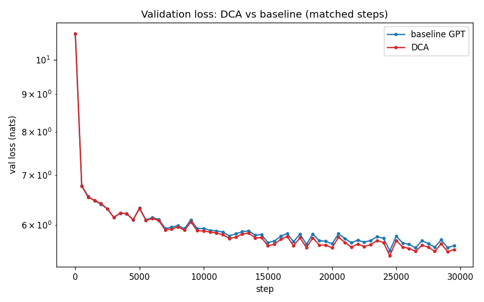
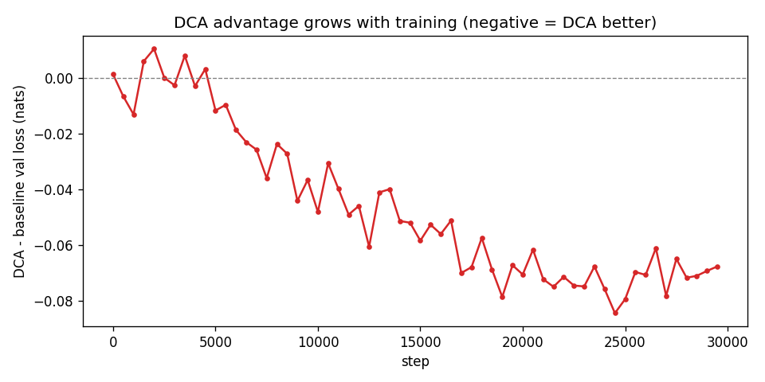
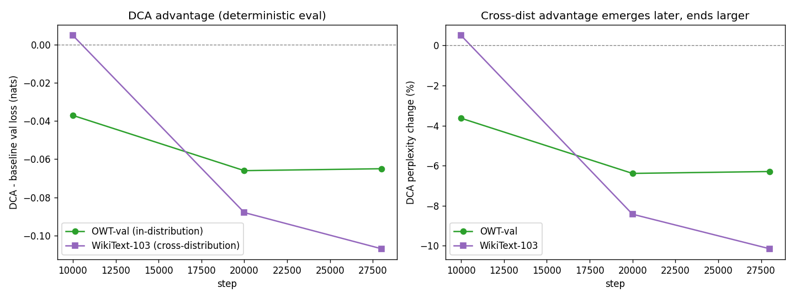
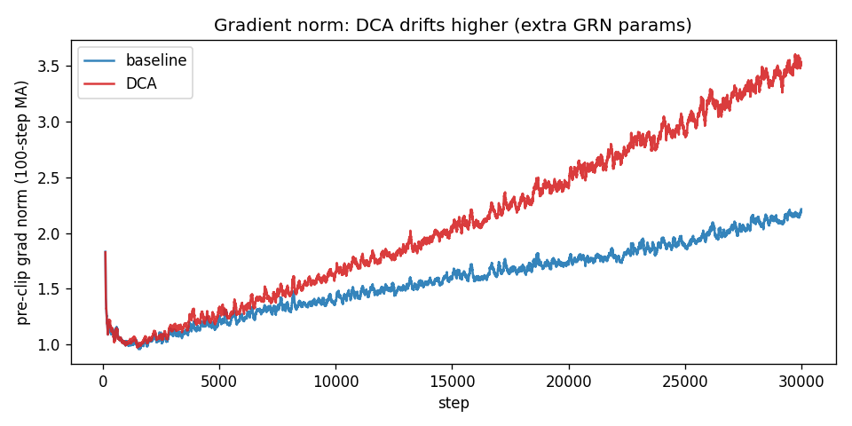

# DeepCrossAttention in rmk — Summary


---

## Context

**DeepCrossAttention (DCA)** — Heddes et al., *"DeepCrossAttention: Supercharging Transformer Residual Connections"*, 2025 — argues that a standard residual connection, which sums all previous layer outputs uniformly, **dilutes information**: it treats every prior layer as equally important, drowning the few useful ones. DCA replaces that uniform sum with a **learned, input-dependent combination**, and applies it three times per block to compose the **Q/K/V inputs** to attention from different depths ("cross-depth attention"). The reported benefit is largest for **narrow, under-parameterized** models.

**Our experiment:** implement DCA on top of our autograd and A/B it against the baseline GPT under an identical config. It delivered a **consistent, deterministically-confirmed** improvement — ~6% lower in-distribution perplexity and ~10% lower cross-distribution perplexity at matched steps.

---

### Overview

The entire DeepCrossAttention (DCA) mechanism is implemented within `rmk/dca.py` and is founded on three core concepts.

---

### 1. The Layer-Output Stack ($G_t$) and Its Handling

For any given layer $t$, the paper defines a stack containing the outputs of all preceding layers:

$$G_t = [f_{t-1}(g_{t-1}(x)), \dots, f_0(g_0(x))] \in \mathbb{R}^{d \times t}$$

In this formulation, $g_0 = 0$ and $f_0(g_0) = x$ (representing the initial model input). While a standard ResNet simply sums these columns equally ($g_t = G_t \mathbf{1}$), DCA replaces the all-ones vector with a **learned combination**.

**Representation Strategy:**
We avoid physically materializing the $d \times t$ matrix in memory. Instead, the stack is maintained as a standard Python list of `(B, T, C)` Tensors, starting with the embedding output ($h_0$) and appending each subsequent block's output. This design choice provides two major benefits:

* **No `concat` or `stack` autograd operations required:** Because DCA utilizes the stack solely for a weighted sum across its columns ($\sum_i \text{column}_i \cdot \text{weight}_i$), we can compute the result by iterating through the Python list using existing basic operations (`*`, `+`, `sum`). This eliminates the need for concatenation primitives and their associated backward passes.
* **Iterative stack growth:** As the forward pass progresses, each block reads the current list and appends its own output.

```python
def forward(self, x):
    stack = [x]                        # h_0 = token + position embedding
    for block in self.blocks:
        stack.append(block(stack))     # Each block reads the full stack and appends its output
    final = self.ln_f(self.grn_f(stack))            # A final GRN operation over the entire stack
    logits = final @ self.wte.weight.transpose()    # Tied Language Modeling head
    return logits

```

*Note on Memory:* Block $i$ (using 0-indexing) observes exactly $i+1$ entries, meaning its GRNs operate with a size of `n_stack = i+1`. While the autograd graph retains every previous block's output (creating a denser graph), the memory overhead is minimal—adding only ~10 MB for a configuration of 6 layers, sequence length $T=256$, and batch size $B=4$.

---

### 2. GRN-v3: The Learned Combination

Given a stack of representations $G = [h_0, \dots, h_{t-1}]$, the GRN-v3 output $g$ is computed as:

$$g = \sum_i h_i \odot (b_i + \text{ReLU}(w^T h_i))$$

* **Static Bias ($b_i$):** A learned weight vector of size $C$ for each specific stack entry. It is initialized to ones and applies a static, per-feature weight.
* **Dynamic Gate ($\text{ReLU}(w^T h_i)$):** An input-dependent gating mechanism. It projects $h_i$ using a learned weight vector $w$ (initialized to zeros), applies a ReLU activation, and broadcasts the scalar result across the feature dimension.
* **Initialization Behavior:** Because $b=1$ and $w=0$ at initialization, the formula simplifies to $g = \sum_i h_i$. This ensures that DCA begins training mathematically identical to a standard Transformer residual sum, only diverging as the parameters update.

**Implementation Details:**

```python
def forward(self, stack):
    out = None
    for h, b in zip(stack, self.bs):
        gate   = relu((h * self.w).sum(axis=-1, keepdims=True))  # Shape: (B, T, 1)
        weight = b + gate                                        # Shape: (B, T, C) via broadcast
        term   = h * weight
        out    = term if out is None else out + term
    return out

```

The per-entry biases ($b_i$) are stored as a Python list of registered tensors of size $C$, rather than a single $(t, C)$ matrix, bypassing the need for a tensor indexing operation. Additionally, `relu` is implemented efficiently as a masked multiplication (`x * (x.data > 0)`), which calculates its backward pass using the existing `__mul__` primitive, preventing the introduction of new gradient operations.

---

### 3. The DCA Block Architecture

The implementation strictly mirrors Figure 4 from the paper:

```python
def forward(self, stack):
    q = self.grn_q(stack)                                    # 3 independent GRN-v3 instances
    k = self.grn_k(stack)
    v = self.grn_v(stack)
    
    a = self.attn(self.ln_q(q), self.ln_k(k), self.ln_v(v))  # Masked cross-attention
    h = self.ln_add(a + q)                                   # Skip #1: "Add & Norm" (residual = GRN-q)
    return a + self.mlp(h)                                   # Skip #2: "Add" only (FFN(h) + a)

```

* **Input Composition:** The attention mechanism remains standard, but its $Q$, $K$, and $V$ inputs are independently composed from the stack via three distinct GRN-v3 modules.
* **Skip Connection #1 ("Add & Norm"):** The raw stack ($d \times t$) cannot be mathematically added to the attention output. Instead, the Query vector ($q$) generated by GRN-q serves as the dimensionally compatible residual shortcut, which is added to the attention output and normalized to produce $h$.
* **Skip Connection #2 ("Add"):** The vector $h$ is passed to the Feed-Forward Network (FFN). The raw attention output $a$ bypasses the FFN and is added directly to its result. The block does *not* output a standard `input + block(input)` residual, as the inter-layer residuals are handled via the stack itself.

---

### 4. Parameter and Autograd Efficiency

The entire DCA architecture is constructed using pre-existing engine primitives (`*`, `+`, `sum`, `matmul`, `softmax`, `layer_norm`, and masked `*` for `relu`). It introduces zero new autograd operations. The only added parameters are the GRN weights, which amount to an increase of **21,696** parameters (a **+0.18%** increase over the **12.37M** baseline). This renders comparisons under the "same configuration" fundamentally fair.

---

### 5. Experimental Setup

The evaluation compares the DCA implementation directly against a baseline OpenWebText (OWT) run, altering only the model class.

| Parameter | Configuration |
| --- | --- |
| **Architecture** | `n_layer=6`, `n_head=6`, `n_embd=192`, `block_size=256`, `vocab=50257`, `dropout=0.0` |
| **Parameter Count** | Baseline: **12.37M** | DCA: **12.39M** (**+0.18%**) |
| **Optimizer** | AdamW, `lr` **6e-4** → **6e-5** (cosine), `warmup` **200**, `weight_decay` **0.1**, `grad_clip` **1.0** |
| **Batch Size** | **4** × **256** = **1024** tokens/step |
| **Dataset** | **99.5M**-token OWT slice (identical seed and order) |
| **Hardware/Backend** | CuPy + fp32, RTX 4050 |
| **Training Steps** | DCA: **30k** | Baseline: **50k** (Comparison evaluated on the overlapping **0–30k** window) |

## Results

### Validation loss (matched steps)



| step | baseline | DCA | Δ (nats) |
|---|---|---|---|
| 0 | 10.854 | 10.855 | +0.001 |
| 5000 | 6.322 | 6.310 | −0.012 |
| 10000 | 5.934 | 5.886 | −0.048 |
| 15000 | 5.682 | 5.623 | −0.058 |
| 20000 | 5.657 | 5.587 | −0.070 |
| 25000 | 5.794 | 5.715 | −0.079 |

### The advantage grows with training



DCA and baseline are **identical at init** (by construction), oscillate around zero for the first ~3000 steps, then DCA pulls monotonically ahead to ~−0.07 nats by step 30k — exactly the paper's mechanism: the GRN weights start at the identity and *learn* to be useful, so the advantage emerges gradually.

### Evaluation (deterministic, full validation sets)

**In-distribution — OWT held-out val (500k tokens):**

| step | baseline PPL | DCA PPL | Δ |
|---|---|---|---|
| 10000 | 371.7 | 358.2 | −3.6% |
| 20000 | 311.1 | 291.3 | −6.4% |
| 28000 | 284.3 | **266.3** | **−6.3%** |

**Cross-distribution — WikiText-103 val (247k tokens):**

| step | baseline PPL | DCA PPL | Δ |
|---|---|---|---|
| 10000 | 1692.8 | 1701.8 | +0.5% |
| 20000 | 1472.5 | 1348.6 | −8.4% |
| 28000 | 1305.3 | **1172.5** | **−10.1%** |



**Insight — the cross-distribution advantage emerges later, then overtakes.** In-distribution, DCA leads from step 10k and plateaus at ~−6%. Cross-distribution, DCA is *tied/slightly behind at 10k* (+0.5%), then swings to −8.4% and −10.1% — ending *larger* than the in-distribution gap.

**Efficiency:** DCA hit its best val (PPL 233) at step 24,500 — nearly matching the baseline's *entire-50k-run* best (PPL 225, reached at step 40,000) — i.e. comparable quality in ~40% fewer steps (at ~2.2× per-step cost from the un-fused stack loop).

---

## Insight — depth, width, and where DCA helps

The paper is explicit about *when* DCA helps, and it explains our result:

- **Width — benefit shrinks as models widen** (their Table 2, 12-layer LM1B): Δ PPL −2.82 at width 64 → −1.57 at 192 → −0.39 at 1024. Narrow models benefit most.
- **Depth — benefit is maintained/grows** (their Fig 6): a 30-layer DCA beats a 42-layer plain transformer; DCA is a more parameter-efficient use of budget than adding layers.
- **Theory:** DCA wins in the **under-parameterized / low-rank regime** (collective layer rank relative to ambient dim below a threshold) — i.e. **narrow + deep**.

Our config — **n_embd=192 (narrow), n_layer=6 (shallow)** — is a *mixed* case: **width is favorable** , **depth is limiting**.

**Prediction:** going deeper (12–18 layers, same width) should *widen* DCA's advantage, since depth is the axis on which the benefit grows while ours is currently minimal.

---

## Insight — gradient norm



| | first 50 steps | last 50 steps |
|---|---|---|
| baseline | 2.22 | 2.17 (flat) |
| DCA | 2.20 | **3.56 (rising)** |

DCA's pre-clip gradient norm **drifts upward** (2.2 → 3.6) while the baseline stays flat. This is the *opposite* of the paper's large-scale stability claim (fewer loss spikes) — at our tiny batch=4 scale, the extra GRN parameters are actively learning and add to the global norm as they move off their identity init.

---

